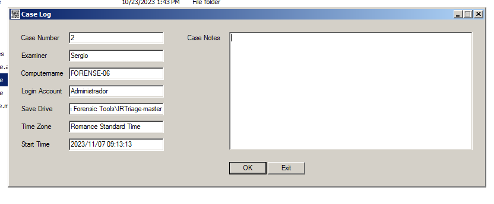

# Incident Investigation (In Live y Post-Mortem)

## Índice

## Introducción

Este documento específica los pasos para la adquisición de evidencias digitales referentes al caso dado en clase. Seguiremos la metodología creada anteriormente para hacer esta adquisición incluyendo varias de las fases que se encuentran explicadas en ella.

Este caso es sobre una máquina virtual por lo tanto varias de las fases tienen que ser explicadas ya que no se pueden llevar a cabo teniendo en cuenta la circunstancia del caso.

La cadena de custodia se hará sobre las evidencias creadas pero con una serie de modificaciones para poder cumplimentar correctamente este caso.

## Identificación

En esta primera fase hemos analizado el escenario del incidente para busca e identificar las posibles evidencias digitales. Las evidencias digitales que hemos podido identificar es un ordenador con el sistema operativo Windows XP que está en funcionamiento en la escena del incidente.

## Adquisición (In Live)

En este apartado del documento explicaré las herramientas usadas y los pasos que he llevado a cabo para realizar la adquisición "in live" de las posibles evidencias digitales de nuestra máquina del incidente.

### Planificación

Seguiremos el orden de volatilidad dado por nuestra metodología para llevar a cabo esta adquisición. Por lo tanto lo primero que haré será el triage para poder sacar la información a priori más volatil de la máquina. A posteriori, haré una imagen de la memoria RAM que en el orden de volatilidad está en el segundo punto y luego haré una imagen del Disco Duro.

Este proceso lo haré a través de las herramientas que se encuentran almacenadas en mi disco duro externo donde guardaré las evidencias para no sobrescribir posibles ficheros borrados.

Esta planificación y la adquisición "In Live" se ha ejecutado por mi parte el Martes 7 de Noviembre de 2023 a las 9:13:13 de la mañana.

El propósito de la siguiente adquisición es obtener información sobre los registros, la memoria RAM y paginación, y además la imagen del disco duro.

### Triage

El primer paso que he llevado a cabo es utilizar la herramienta IR Triage para llevar a cabo este proceso. He rellenado la información referente al caso para llevar un control del caso.

Lo primero que queremos sacar de la máquina en la que ha habido el incidente, es la memoria más volatil, por ejemplo los registros del sistema.

He usado la herramienta con los apartados marcados por defecto, ya que en el orden de volatilidad que tenemos en nuestra metodología, parte de esa información la deberemos tener en cuenta también aunque sea a posteriori.

Después de que ha terminado el proceso, he comprobado de que esa información realmente ha sacado esa información.

### Memoria RAM

El siguiente paso que he hecho es sacar una imagen de la memoria RAM y del fichero de páginación. Para esto he usado la herramienta de Belkasoft llamada Ram Live Capturer.

He ejecutado la herramienta desde el disco duro externo y he seleccionado que el directorio de salida sea una carpeta creada como nueva para guardar esta imagen.

El programa llamado Ram Live Capturer, no hace el cálculo del Hash, por lo tanto he hecho el Hash por powershell haciendo el cálculo por MD5 y por SHA1 para poder comprobarse cuando transfiera esta adquisición.

Este Hash se ha ejecutado el Viernes 10 de Noviembre a las 9:18:00 de la mañana antes de ser transferido.

### Disco Duro

Después de terminar el proceso de captura de memoria RAM, he iniciado el proceso de captura de una imagen del Disco Duro. En este proceso usaré la herramienta FTK Imager en una versión antigua puesto que la versión más nueva da una serie de problemas que solo pueden solucionarse con una versión anterior.

He ejecutado el programa, clicado en file y clic en Create Disk Image.

He seleccionado que el tipo de disco es físico.

En la siguiente ventana he seleccionado el disco duro del ordenador.

Una vez seleccionar el disco duro, he especificado clicando en la casilla para precalcular el progreso para que nos muestre durante el proceso cuanto va a durar. He clicado en Add para definir donde quiero guardar la imagen del disco y en que formato, el seleccionado ha sido AFF.

Luego he rellenado la información del caso y la evidencia con el número del caso y el número de la evidencia.

El siguiente paso es seleccionar la carpeta de destino donde se guardará la imagen y el nombre con el que se guardará.

He ejecutado el proceso de la creación de la imagen y he esperado a que termine.

Como podemos ver en esta imagen, nos muestra cuanto tardará en terminar el proceso. La duración de la creación de la imagen varía durante el proceso.

Una vez terminado el proceso he comprobado que nuestra imagen ha sido creada.

## Adquisición (Post-Mortem)

Una vez terminada la adquisición In Live, pasaremos a adquirir el disco duro de nuestra máquina de manera física y una vez apagado el sistema.

Este proceso se ejecutó el Martes 7 de Noviembre a las 18:00 de la tarde.

Como en este caso nuestro ordenador es una máquina virtual, deberemos copiar el disco duro de la máquina virtual de la carpeta que nos crea en nuestro disco duro al disco duro externo. Este proceso debe ser con la máquina apagada.

Lo pegaremos en la carpeta que he creado limpia para guardar el disco duro de la máquina virtual.

## Preservar

En la fase de preservar de nuestra metodología usada, guardaremos las evidencias en un disco duro externo para mantener la integridad de los posibles datos guardados en los discos duros de la máquina. Este proceso al ser en un caso de una máquina virtual, no podemos usar indumentaria adecuada para proteger el ordenador de descargas electroestáticas.

## Fases de análisis y presentación

En este caso no vamos a implementar estas tres fases que quedan de nuestra metodología. El motivo es que hasta este momento, no debemos realizar esta tarea hasta que no entremos en materia referente a estas tres fases restantes.

La fase de documentación se ha ido realizando paso a paso mediante adquiría las evidencias.

## Metodología

La metodología usada ha sido la metodología creada en un trabajo anteriormente con las prácticas más correctas o necesarias para adquirir y analizar los futuros casos que podamos recibir.

Varias de estas fases como ya se ha explicado en secciones anteriores, no pueden llevarse a cabo dada las circunstancia del caso.

Esta metodología tiene 6 fases con una serie de instrucciones y deben ser cumplidas obligatoriamente. 

## Cadena de custodia

La cadena de custodia define en este apartado características sobre las evidencias adquiridas en el proceso de adquisición y a quién será transferida.

Ahora se proporcionan imagenes de las cadena de custodia de cada evidencia.

### Evidencia 001

### Evidencia 002

### Evidencia 003

### Evidencia 004

