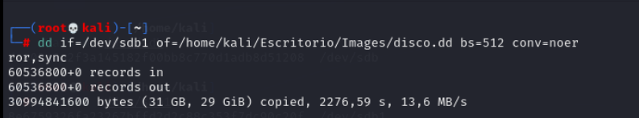

# Adquisición de una memoria USB con FTK Imager, Guymager y dd

## Índice

[Adquisición forense con FTK Imager](#adquisición forense con FTK Imager)

## Adquisición forense con FTK Imager

Usaré FTK Imager en una máquina virtual Windows 10 para adquirir una imagen de una memoria USB de 32 GB con un formato en exFAT. Esta imagen será guardada en un disco duro externo de 1TB donde se guardará en una carpeta.

He usado el formato AFF creado para la adquisición y análisis forense. Después de seleccionar el formato he rellenado la información del caso con mi nombre puesto en el apartado examinador y una descripción y he decidido que se creen fragmentos de 4500MB.

## Adquisición forense con Guymager

La siguiente adquisición se hace a través de Kali Linux y Guymager. En este caso he tenido problemas con los permisos de escritura en el disco duro externo que no he conseguido solucionar pese a que tenía bien los permisos. Por lo tanto, la imagen la guardaremos en la misma máquina en una carpeta que he creado en el escritorio. /n
He tenido que extender el tamaño del disco duro de la máquina virtual de Kali Linux.

Una vez preparado los dispositivos para la adquisición, decidí que se dividiera en partes de 4GB y no he usado el formato dd raw image de linux, sino el formato por defecto. 

## Adquisición forense con dd

En esta adquisición he seguido la guía que se encuentra en las referencias del tema y he investigado un poco cada opción que tiene el comando para poder ejecutarlo. La imagen adquirida del dispositivo USB la he guardado en la máquina en una carpeta.

He ejecutado el comando al igual que se encuentra en la guía después de montar el dispositivo USB y he esperado a que termine de adquirirse. El nombre que he escogido es el mismo que se encontraba en la guía con la extensión .dd.

